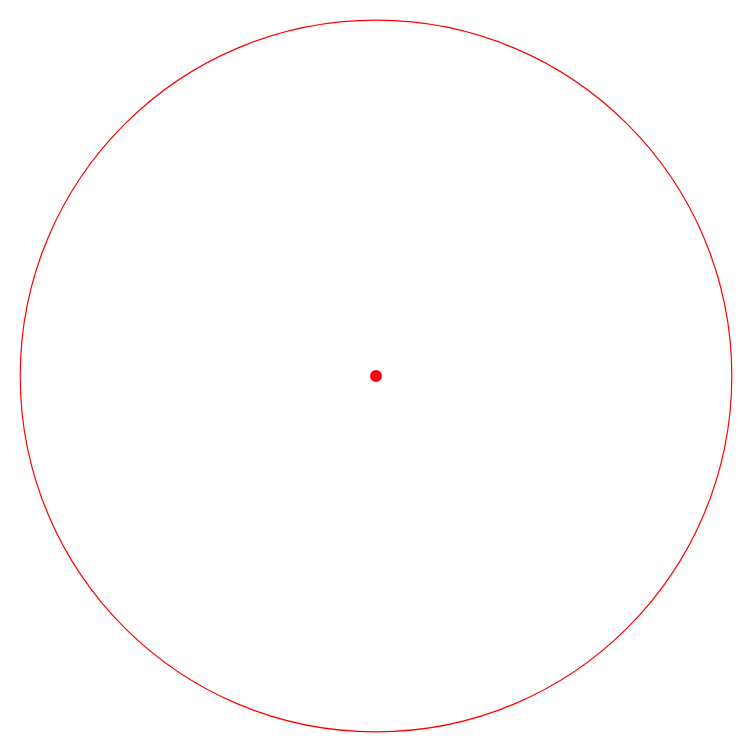
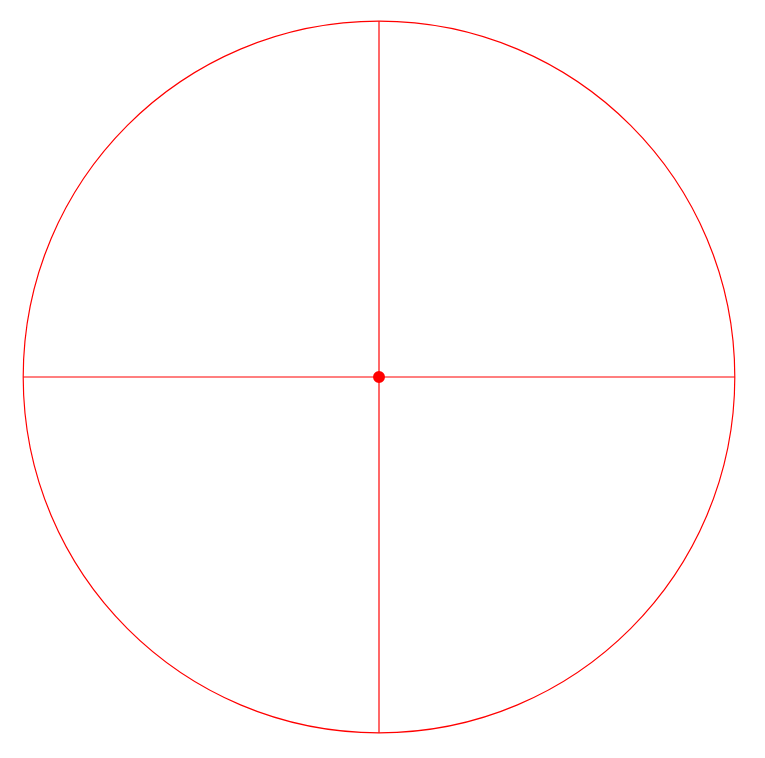
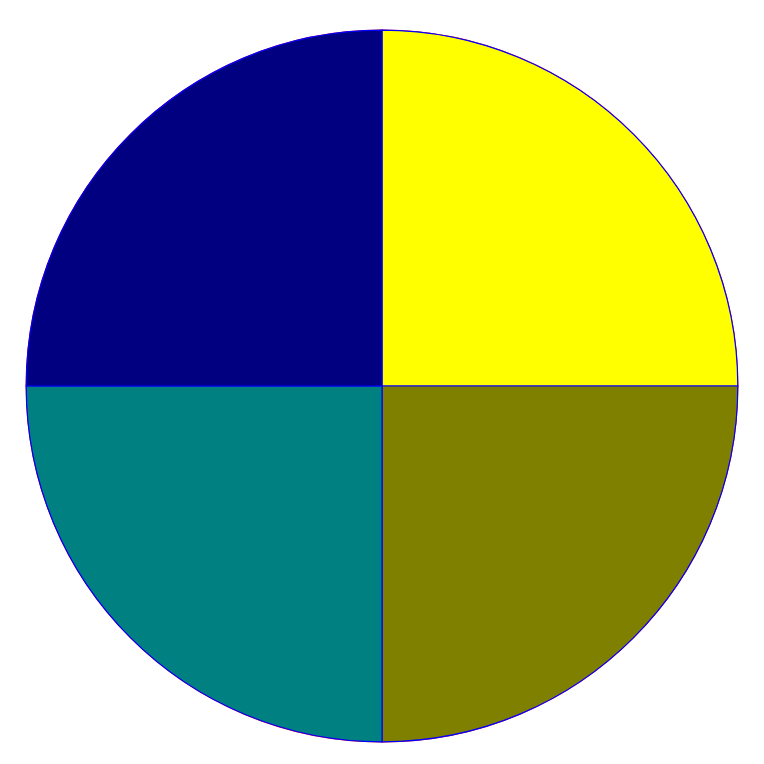

# Talentoday interview - Make a radar in python

This challenge will require you to know or learn some basics of flask, a minimal web framework for python as well as the SVG syntax.

Some useful resources:
  - https://developer.mozilla.org/en-US/docs/Web/SVG
  - https://www.w3schools.com/graphics/svg_examples.asp
  - https://flask.palletsprojects.com/en/1.1.x/quickstart/#a-minimal-application

## Steps to complete

  1. Clone and install this project (python3, see requirements.txt)
  2. Run it with `python server.py`, you should be able to visit http://localhost:5000/radar:
    
  3. Add lines delimiting the circle's quarters:
    
  4. Finally colorize the quarters
    

## Please note

  - You may want to disable browser cache while developing
  - The CSS stylesheet used to create the final version is available in `static/app.css` (it can help to retrieve the colors)

## How to send us your work?

  - Create a fork of this repository
  - Push your changes to your fork, make sure to divide your work into smaller commits
  - Send the fork's url to a.chakroun@talentoday.com